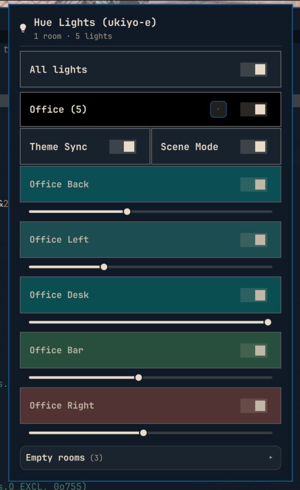

# omarchy-philips-hue

Omarchy / Quickshell bar widget for controlling Philips Hue lights over the bridge's local HTTP API (v1).

<p align="center">
  
</p>

## Features

- Bar icon (lightbulb) that opens a control panel
- Toggle all rooms, individual rooms, or single lights
- Per-light brightness slider
- Per-light color temperature slider (warm ⇄ cool white)
- Per-light color wheel picker (hue + saturation) and color temperature slider;
  both hidden for lights in rooms with theme sync enabled
- Reads credentials from `~/.local/state/omarchy/settings/hue.json`
- Retries / re-fetches state automatically after every change

## Requirements

- Arch Linux + Omarchy (Quickshell-based shell)
- `curl`, `python3` (for the pairing script), `omarchy-shell`

## Install

```sh
omarchy plugin add https://github.com/sethchev/omarchy-philips-hue.git --enable
```

## Pairing with the bridge

On first run the bar shows a lightbulb icon. Click it to open the panel, then
click **Pair with bridge**. This opens a terminal — press the link button on
your Hue bridge when prompted. The script discovers the bridge, requests a
username, and writes `~/.local/state/omarchy/settings/hue.json`. The panel
picks up the new credentials automatically within seconds.

You can also pair manually:

```sh
~/.config/omarchy/plugins/omarchy-philips-hue/pair.sh
```

Pass an IP directly to skip auto-discovery: `pair.sh 192.168.1.14`.

## Syncing lights with the omarchy theme

A theme-set hook (`45-hue.sh`, vendored in `theme-sync/`) recolors every
room/zone to the active theme's `accent` whenever you run `omarchy theme set`.
The bar widget picks the change up within its 15 s poll.

### Per-room opt-out

Each room that is switched on gets a **Theme Sync** toggle in the panel,
right below its own toggle. Every room starts out synced; toggling a room
off excludes it from theme changes until you re-enable it.

While a room is synced, its lights' color wheel and color temperature
slider are hidden in the panel — the hook owns their color, so manual
picking would be overwritten anyway. Rooms with sync off keep full manual
control.

The toggle states live under the `themeSync` key of `hue-theme.json`
(missing room = enabled), and are picked up by the hook immediately — no
restart needed.

### Install

The repo ships everything needed under `theme-sync/`:

```sh
~/.config/omarchy/plugins/omarchy-philips-hue/theme-sync/install.sh
```

This copies `45-hue.sh` to `~/.config/omarchy/hooks/theme-set.d/` (make it
executable) and writes a default `hue-theme.json` to
`~/.config/omarchy/settings/` if you don't have one yet. No shell restart is
needed — the hook is picked up on the next `omarchy theme set`.

To install manually instead:

```sh
mkdir -p ~/.config/omarchy/hooks/theme-set.d ~/.config/omarchy/settings
cp theme-sync/45-hue.sh ~/.config/omarchy/hooks/theme-set.d/45-hue.sh
chmod +x ~/.config/omarchy/hooks/theme-set.d/45-hue.sh
cp -n theme-sync/hue-theme.json ~/.config/omarchy/settings/hue-theme.json
chmod 600 ~/.config/omarchy/settings/hue-theme.json
```

Behavior is configured in `~/.config/omarchy/settings/hue-theme.json`:

```json
{
  "enabled": true,
  "transition": 20,
  "groups": ["all"],
  "bri": null,
  "turnOn": false,
  "themes": {},
  "themeSync": {}
}
```

- `transition` — fade length in tenths of a second (20 = 2 s)
- `groups` — `["all"]`, or a subset of room/zone names to sync
- `bri` — optional forced brightness (1–254); leave `null` to keep each light's current brightness
- `turnOn` — `true` to turn lights on when syncing; `false` leaves on/off state untouched
- `themes` — per-theme hex overrides, e.g. `{ "spacehaven": "#0c8184" }`; themes without an override use their own `accent`
- `themeSync` — per-room opt-out map written by the panel's Theme Sync toggles, e.g. `{ "kitchen": false }`; rooms missing from the map are synced

Test the hook without changing your theme:

```sh
bash ~/.config/omarchy/hooks/theme-set.d/45-hue.sh <theme-slug>
```

## Remove

```sh
~/.config/omarchy/plugins/omarchy-philips-hue/cleanup.sh
omarchy plugin remove omarchy-philips-hue
```

The cleanup script removes your bridge credentials from
`~/.local/state/omarchy/settings/hue.json`. Run it before removing the
plugin so no auth token is left behind.

## Notes

- Speaks to the bridge over **HTTPS** on your LAN with the v1 API
  (`/api/<username>/lights`, `/groups`, etc.) — no cloud, no SDK.
- TLS is verified with the bundled `hue_bridge_cacert.pem`, the official
  Philips Hue root CA from Signify. During pairing, the bridge's unique ID
  is read from `/api/config` and saved as `bridgeId` in `hue.json`; requests
  are then addressed to that ID so the bridge certificate's hostname is
  matched, while the connection itself goes straight to the bridge's IP.
- Automatic discovery tries **mDNS** first (`avahi-browse -t -r _hue._tcp`,
  the same on-LAN mechanism the official Hue app uses), then falls back to
  Philips' hosted lookup `discovery.meethue.com`. Pass an IP directly to
  `pair.sh` to skip auto-discovery entirely.
- If `bridgeId` is missing (e.g. from an older config), the panel warns
  "TLS verification disabled" — re-run `pair.sh` to restore full
  certificate verification.
- Uses the classic v1 local API, which every current bridge still serves —
  including the 2025 Bridge Pro (HTTPS-only, `apiversion` 1.73.x). New Hue
  features ship exclusively in the v2 API and Signify has said v1 will be
  removed long-term, but no end-of-life date has been announced.
- Credentials are stored per-user in `~/.local/state/omarchy/settings/hue.json`;
  keep that file out of version control.
